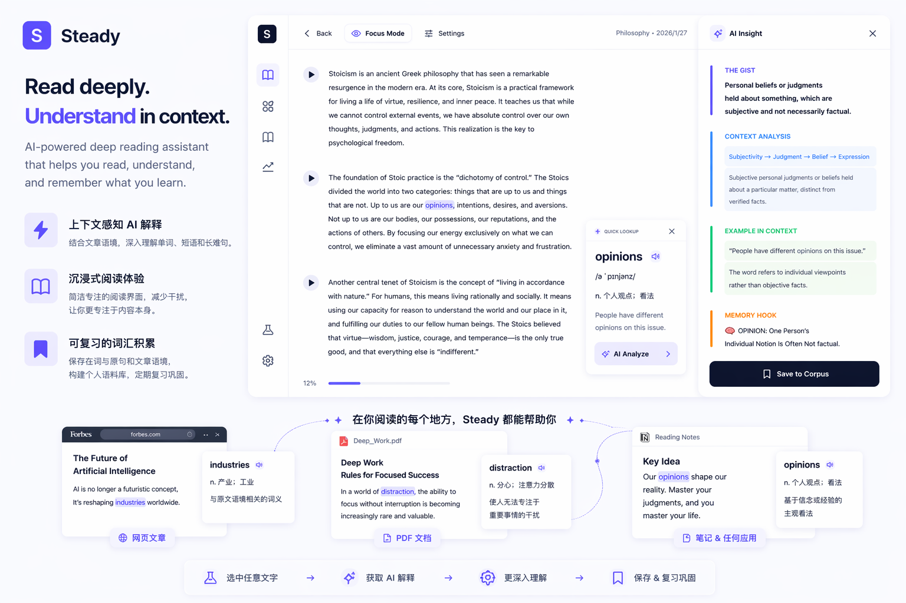

# Steady

> AI 驱动的深度阅读与语言学习助手，面向外语文章阅读场景。  
> Stop switching tabs. Start reading with flow.



---

## 产品理念

Steady 建立在一个简单信念上：

> 语言学习中的帮助，应该在正确的时间、正确的位置，以刚刚好的信息量出现。

不太多。  
不太少。  
刚好足够让阅读继续向前。

---

## 为什么做 Steady？

外语文章阅读很容易被打断。

你从一篇文章开始，接着跳到词典，再打开翻译工具，然后搜索语法解释，最后把有用的词句复制到笔记里。等这些动作做完，阅读的连贯感也消失了。

**Steady 想解决的就是这个问题。**

它把**阅读、查词、理解、沉淀、复习**连接成一个连续流程，让用户在保持专注的同时，仍然能得到必要的语言帮助。

## Steady 有什么不同？

Steady **不只是词典**，也**不只是文章阅读器**。

它围绕一个核心想法设计：

> 阅读应该保持沉浸，辅助应该基于上下文。

这意味着：

- 用户在安静、低干扰的界面中阅读
- 单词、短语、长难句可以在当前页面内快速解释
- AI 解释基于真实文章语境，而不是孤立释义
- 有价值的词句会和来源句子、文章上下文一起保存
- 收集到的内容可以进入后续复习流程

---

## 核心流程

1. 导入或打开一篇文章
2. 在沉浸式阅读器中阅读
3. 选中单词、短语或句子进行快速查词
4. 需要时展开更深入的 AI 分析
5. 保存有价值的生词和语境
6. 之后回到复习流程中重复接触

---

## 核心功能

### 沉浸式阅读

提供安静、轻量的阅读界面，减少干扰，让用户专注于文章本身。

### 上下文查词

对选中的单词、短语和长难句提供快速解释，解释会结合周围语境，而不是只给孤立词典义。

### AI 深度理解

不止于翻译，还可以辅助生成文章总结、语法说明、主题分析、文化背景、语气和隐含含义。

### 生词沉淀

保存生词时同时保留来源句子、文章上下文和语境中的含义。

### 复习闭环

把阅读中产生的内容转化为可复用的学习资料，通过复习和重复接触形成长期积累。

### 跨平台支持

- **Web**：承载核心阅读和学习流程
- **Desktop (Tauri)**：承载剪贴板、跨应用阅读辅助等系统级能力

### Serverless AI 后端

通过 Serverless API 管理 AI 生成、翻译、认证、文章解析和后续数据访问。

---

## 设计原则

### 阅读优先

任何功能都不应该破坏主要阅读体验。

### 上下文优先

释义和解释应该基于文章语境，而不是脱离上下文。

### 渐进展示

先展示最关键的答案，再允许用户按需展开深度分析。

### 平台边界清晰

Web 能力和桌面端系统能力要保持清晰边界，避免互相耦合。

---

## 技术栈

- **Frontend:** Vue 3、TypeScript、Vite、Pinia、Tailwind CSS
- **Desktop:** Tauri v2、Rust
- **Backend:** Vercel Serverless Functions、Node.js、TypeScript
- **AI Layer:** Vercel AI SDK、OpenAI-compatible providers、Google Generative AI
- **Data Layer:** Prisma-ready structure
- **Testing:** Vitest

---

## 快速开始

### 环境要求

- Node.js 18+
- npm
- 桌面端开发需要 Rust 和对应平台构建工具
- 部署需要 Vercel 账号

### 安装依赖

```bash
npm install
```

### 配置环境变量

复制 `.env.example` 为 `.env`，并填入需要的密钥：

```bash
GOOGLE_GENERATIVE_AI_API_KEY=your_gemini_key
DASHSCOPE_API_KEY=your_dashscope_key
DEEPSEEK_API_KEY=your_deepseek_key
```

### 启动 Web 应用

```bash
npm run dev
```

### 启动桌面端

```bash
npm run tauri dev
```

### 构建

```bash
npm run build
```

### 测试

```bash
npm test
```

---

## 项目文档

- [文档总览](./docs/README.md)
- [产品说明](./docs/PRODUCT.md)
- [架构说明](./docs/ARCHITECTURE.md)
- [开发指南](./docs/DEVELOPMENT.md)
- [环境变量](./docs/ENVIRONMENT.md)
- [API 文档](./docs/API.md)
- [部署指南](./docs/DEPLOYMENT.md)

---

## 当前状态

Steady 仍在积极开发中。

当前版本重点验证这一闭环：

**Read -> Understand -> Save -> Review**

---

## License

No license has been specified yet.
